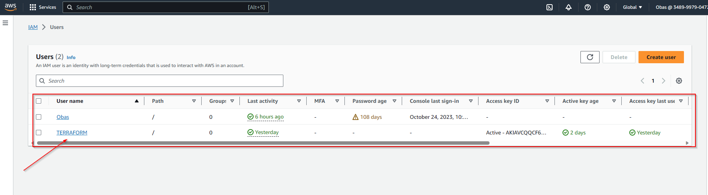
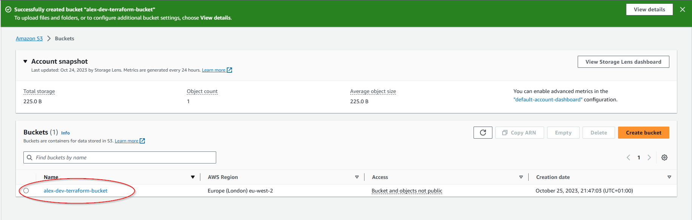

# Project-16
## INFRASTRCTURE AS CODE (IaC) - AUTOMATE AWS CLOUD SOLUTION FOR 2 COMPANY WEBSITES USING A REVERSE PROXY TECHNOLOGY WITH TERRAFORM


### Prerequisites

1. Create an IAM user, name it *terraform* (ensure that the user has only programatic access to your AWS account) and grant this user AdministratorAccess permissions.
1. Copy the secret access key and access key ID. Save them in a notepad temporarily.
1. Configure programmatic access from your workstation to connect to AWS using the access keys copied above. Ensure You have Python 3.6 or higher on your workstation.



consider using GitBash If you are on Windows.

For easier authentication configuration – use AWS CLI with aws configure command.

Create an S3 bucket to store Terraform state file. You can name it something like *yourname*-dev-terraform-bucket (Note: S3 bucket names must be unique unique within a region partition) - We will use this bucket from Project-17 onwards.

 




make sure you can programmatically access your AWS account by running following commands in AWS cli

```
aws s3 ls
```

You shall see your previously created S3 bucket name – *yourname*-dev-terraform-bucket


### The secrets of writing quality Terraform code

The secret recipe of a successful Terraform projects consists of:

 - Your understanding of your goal (desired AWS infrastructure end state)
 - Your knowledge of the IaC technology used (in this case – Terraform)
 - Your ability to effectively use up-to-date Terraform documentation [here](https://www.terraform.io/docs/configuration).

As you go along completing this project, you will get familiar with Terraform-specific terminology, such as:

 - [Attribute](https://www.terraform.io/docs/glossary.html#attribute)
 - [Resource](https://www.terraform.io/docs/glossary.html#resource)
 - [Interpolations](https://www.terraform.io/docs/glossary.html#interpolation)
 - [Argument](https://www.terraform.io/docs/glossary.html#argument)
 - [Providers](https://www.terraform.io/docs/providers/index.html)
 - [Provisioners](https://www.terraform.io/docs/language/resources/provisioners/index.html)
 - [Input Variables](https://www.terraform.io/docs/glossary.html#variables)
 - [Output Variables](https://www.terraform.io/docs/glossary.html#output-values)
 - [Module](https://www.terraform.io/docs/glossary.html#module)
 - [Data Source](https://www.terraform.io/docs/glossary.html#data-source)
 - [Local Values](https://www.terraform.io/docs/configuration-0-11/locals.html)
 - [Backend](https://www.terraform.io/docs/glossary.html#backend)

Make sure you understand them and know when to use each of them.

### Best practices
 - Ensure that every resource is tagged using multiple key-value pairs. You will see this in action as we go along.
 - Try to write reusable code, avoid hard coding values wherever possible. (For learning purpose, we will start by hard coding, but gradually refactor our work to follow best practices).

## VPC | SUBNETS | SECURITY GROUPS

## VPC 

### Create a directory structure
Open your Visual Studio Code and:

 - Create a folder called PBL
 - Create a file in the folder, name it main.tf


### Provider and VPC resource section

Set up Terraform CLI as per [this instruction](https://learn.hashicorp.com/tutorials/terraform/install-cli).

 - Add AWS as a *provider*, and a *resource* to create a VPC in the *main.tf* file.
 - Provider block informs Terraform that we intend to build infrastructure within AWS.
 - Resource block will create a VPC.

 coppy the snippet below:

 ```
 provider "aws" {
  region = "eu-west-2"
}

# Create VPC
resource "aws_vpc" "main" {
  cidr_block                     = "172.16.0.0/16"
  enable_dns_support             = "true"
  enable_dns_hostnames           = "true"
  enable_classiclink             = "false"
  enable_classiclink_dns_support = "false"
}
 
 ```


 **Note:** You can change the configuration above to create your VPC in other region that is closer to you. The same applies to all configuration snippets that will follow.

 - The next thing we need to do, is to download necessary plugins for Terraform to work. These plugins are used by *providers* and *provisioners*. 
At this stage, we only have provider in our *main.tf* file. So, Terraform will just download plugin for AWS provider.

 - Lets accomplish this with *terraform init* command as seen below.


#### Observations:

Notice that a new directory has been created: .terraform\.... This is where Terraform keeps plugins. 
Generally, it is safe to delete this folder. It just means that you must execute terraform init again, to download them.

Moving on, let us create the only resource we just defined. *aws_vpc*. But before we do that, we should check to see what terraform intends to create before we tell it to go ahead and create it.

Run *terraform plan*

 

Then, if you are happy with changes planned, execute *terraform apply*


#### Observations:

A new file is created *terraform.tfstate* This is how Terraform keeps itself up to date with the exact state of the infrastructure. It reads this file to know what already exists, what should be added, or destroyed based on the entire terraform code that is being developed.

If you also observed closely, you would realize that another file gets created during planning and apply. But this file gets deleted immediately. *terraform.tfstate.lock.info* This is what Terraform uses to track, who is running its code against the infrastructure at any point in time. This is very important for teams working on the same Terraform repository at the same time. The lock prevents a user from executing Terraform configuration against the same infrastructure when another user is doing the same – it allows to avoid duplicates and conflicts.

Its content is usually like this.

    {
        "ID":"e5e5ad0e-9cc5-7af1-3547-77bb3ee0958b",
        "Operation":"OperationTypePlan","Info":"",
        "Who":"name@name","Version":"0.13.4",
        "Created":"2020-10-28T19:19:28.261312Z",
        "Path":"terraform.tfstate"
    }

It is a json format file that stores information about a user: user’s ID, what operation he/she is doing, timestamp, and location of the state file.

### Subnets resource section

According to our architectural design above, we will require 6 subnets:

- 2 public
- 2 private for webservers
- 2 private for data layer

Let us create the first 2 public subnets.

Add below configuration to the main.tf file:

```
# Create public subnets1
    resource "aws_subnet" "public1" {
    vpc_id                     = aws_vpc.main.id
    cidr_block                 = "172.16.0.0/24"
    map_public_ip_on_launch    = true
    availability_zone          = "eu-west-2a"

}

# Create public subnet2
    resource "aws_subnet" "public2" {
    vpc_id                     = aws_vpc.main.id
    cidr_block                 = "172.16.1.0/24"
    map_public_ip_on_launch    = true
    availability_zone          = "eu-west-2b"
}
```


 - We are creating 2 subnets, therefore declaring 2 resource blocks – one for each of the subnets.
 - We are using the *vpc_id* argument to interpolate the value of the VPC *id* by setting it to *aws_vpc.main.id*. This way, Terraform knows inside which VPC to create the subnet.

Run terraform plan and terraform apply


#### Observations:

- Hard coded values: Remember our best practice hint from the beginning? Both the *availability_zone* and *cidr_block* arguments are hard coded. We should always endeavour to make our work dynamic.

- Multiple Resource Blocks: Notice that we have declared multiple resource blocks for each subnet in the code. This is bad coding practice. We need to create a single resource block that can dynamically create resources without specifying multiple blocks. Imagine if we wanted to create 10 subnets, our code would look very clumsy. So, we need to optimize this by introducing a *count* argument.